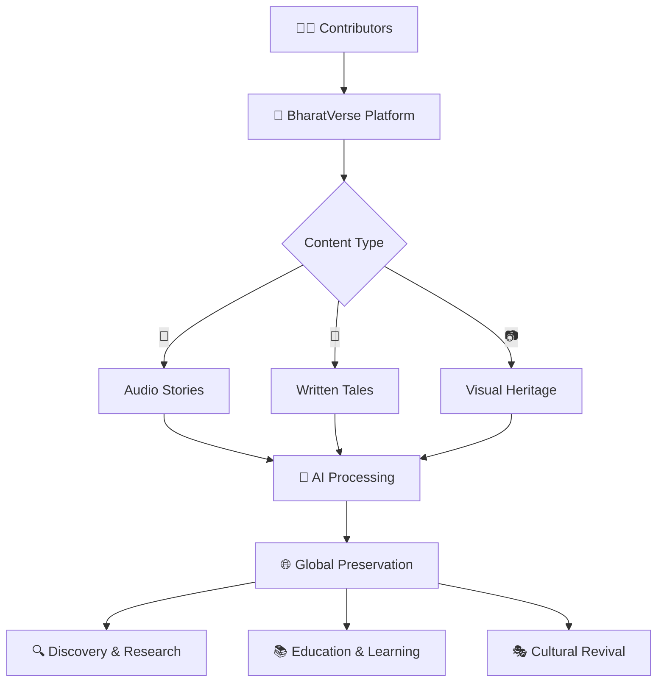
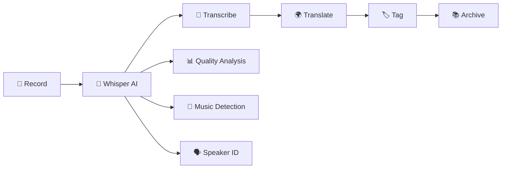
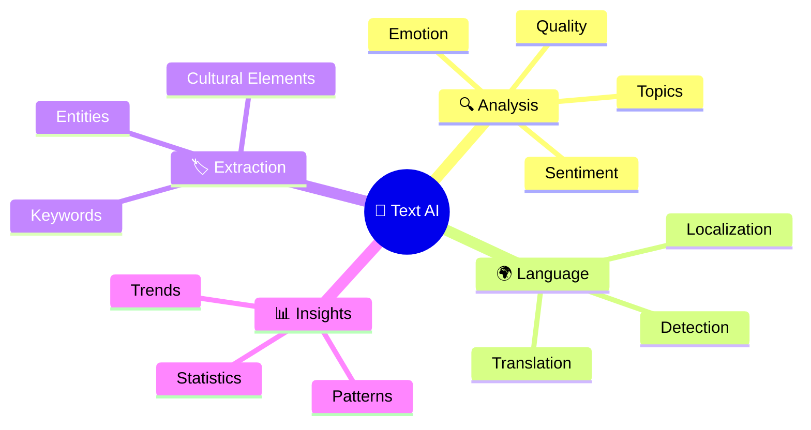
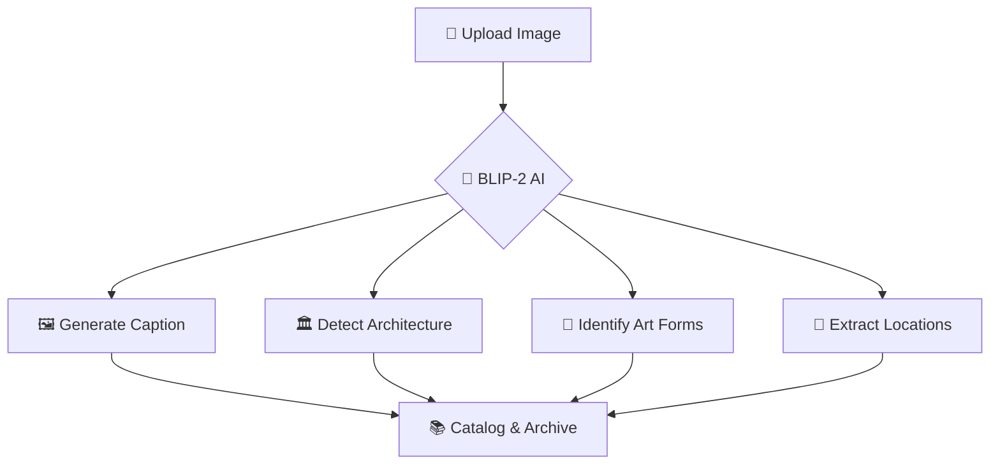

# 🇮🇳 BharatVerse - AI-Powered Cultural Heritage Platform

<div align="center">

```
██████╗ ██╗  ██╗ █████╗ ██████╗  █████╗ ████████╗██╗   ██╗███████╗██████╗ ███████╗███████╗
██╔══██╗██║  ██║██╔══██╗██╔══██╗██╔══██╗╚══██╔══╝██║   ██║██╔════╝██╔══██╗██╔════╝██╔════╝
██████╔╝███████║███████║██████╔╝███████║   ██║   ██║   ██║█████╗  ██████╔╝███████╗█████╗  
██╔══██╗██╔══██║██╔══██║██╔══██╗██╔══██║   ██║   ╚██╗ ██╔╝██╔══╝  ██╔══██╗╚════██║██╔══╝  
██████╔╝██║  ██║██║  ██║██║  ██║██║  ██║   ██║    ╚████╔╝ ███████╗██║  ██║███████║███████╗
╚═════╝ ╚═╝  ╚═╝╚═╝  ╚═╝╚═╝  ╚═╝╚═╝  ╚═╝   ╚═╝     ╚═══╝  ╚══════╝╚═╝  ╚═╝╚══════╝╚══════╝
```

### **🎯 Preserving India's Cultural Heritage with AI** 
**Capture • Preserve • Share • Discover**

<p>
  
  
  
  
</p>

<p>
  
  
  
  
  
</p>

</div>

---

## 🚀 **Quick Access**

<div align="center">

| 🌐 **Live Demo** | ☁️ **Deploy Your Own** | 📖 **Documentation** | 💬 **Community** |
|:---:|:---:|:---:|:---:|
| [**Try BharatVerse**](https://amruthjakku-bharatverse.streamlit.app) | [**Free Cloud Setup**](#-free-cloud-deployment) | [**User Guide**](#-features) | [**Discord**](https://discord.gg/bharatverse) |
| *Experience all features live* | *Deploy in 5 minutes* | *Complete guides* | *Join our community* |

</div>

---

## 🎯 **What is BharatVerse?**

BharatVerse is a **production-ready, AI-powered cultural heritage platform** that enables communities to preserve, share, and discover India's rich cultural traditions using cutting-edge technology.

<div align="center">



</div>

### ✨ **Key Capabilities**

<table>
<tr>
<td width="50%">

#### 🎙️ **Intelligent Audio Processing**
```
🎤 Record → 🤖 AI Transcribe → 🌍 Translate → 📚 Archive
```
- **Whisper AI**: 99+ language support
- **Real-time transcription**
- **Cultural context detection**
- **Quality enhancement**

#### 📝 **Smart Text Analysis**
```
✍️ Write → 🔍 Analyze → 🏷️ Tag → 📊 Insights
```
- **Sentiment analysis**
- **Cultural element extraction**
- **Multi-language support**
- **Auto-categorization**

</td>
<td width="50%">

#### 🖼️ **Vision AI Processing**
```
📸 Upload → 👁️ Analyze → 🏛️ Detect → 📋 Catalog
```
- **BLIP-2 image captioning**
- **Cultural artifact detection**
- **Architecture recognition**
- **Quality assessment**

#### 🌐 **Zero-Cost Scaling**
```
☁️ Cloud → 🆓 Free Tier → 📈 Scale → 💰 $0/month
```
- **Streamlit Cloud hosting**
- **Free AI APIs**
- **Automated deployment**
- **Production-ready**

</td>
</tr>
</table>

---

## 🏗️ **System Architecture**

<div align="center">

### 🌟 **Cloud-Native Architecture**

```
┌─────────────────────────────────────────────────────────────────┐
│                    🌍 Global Users                               │
└─────────────────────┬───────────────────────────────────────────┘
                      │
┌─────────────────────▼───────────────────────────────────────────┐
│                🌐 Streamlit Cloud (FREE)                       │
│  ┌─────────────────────────────────────────────────────────┐   │
│  │             🏛️ BharatVerse Application                  │   │
│  │                                                         │   │
│  │  📱 Pages        🤖 AI Manager       📊 Analytics       │   │
│  │  ├─ Audio        ├─ Orchestrator    ├─ Real-time       │   │
│  │  ├─ Text         ├─ Caching         ├─ Insights        │   │
│  │  ├─ Visual       └─ Error Handling  └─ Trends          │   │
│  │  └─ Enhanced AI                                         │   │
│  └─────────────────────┬───────────────────────────────────┘   │
└────────────────────────┼───────────────────────────────────────┘
                         │
┌────────────────────────▼───────────────────────────────────────┐
│                   ⚡ Processing Layer                          │
│                                                               │
│ ┌─────────────┐ ┌─────────────┐ ┌─────────────┐ ┌───────────┐│
│ │🔮 Inference │ │⚡ Redis     │ │🐘 PostgreSQL │ │🪣 R2      ││
│ │  Manager    │ │  Cache      │ │  Database   │ │  Storage  ││
│ │             │ │             │ │             │ │           ││
│ │• API Calls  │ │• AI Results │ │• User Data  │ │• Files    ││
│ │• Processing │ │• Rate Limit │ │• Analytics  │ │• Media    ││
│ │• Validation │ │• Sessions   │ │• Metadata   │ │• Backups  ││
│ └─────────────┘ └─────────────┘ └─────────────┘ └───────────┘│
└───────────────────────┬───────────────────────────────────────┘
                        │
┌───────────────────────▼───────────────────────────────────────┐
│                  🤖 AI Service Layer                          │
│                                                               │
│ ┌─────────────┐ ┌─────────────┐ ┌─────────────┐ ┌───────────┐│
│ │🎤 Whisper   │ │📝 RoBERTa   │ │🖼️ BLIP-2    │ │🌍 NLLB    ││
│ │Large-v3     │ │Sentiment    │ │Vision       │ │Translation││
│ │             │ │             │ │             │ │           ││
│ │Speech→Text  │ │Emotion      │ │Image→Text   │ │Multi-lang ││
│ │99 Languages │ │Analysis     │ │Description  │ │200+ Langs ││
│ └─────────────┘ └─────────────┘ └─────────────┘ └───────────┘│
└───────────────────────────────────────────────────────────────┘
```

</div>

---

## ☁️ **Free Cloud Deployment**

Deploy BharatVerse with **zero infrastructure costs** using our cloud-native architecture!

<div align="center">

### 🎯 **5-Minute Deployment**

| Step | Service | Action | Cost |
|:---:|:---:|:---:|:---:|
| 1️⃣ | **Streamlit Cloud** | Deploy frontend | 🆓 Free |
| 2️⃣ | **Supabase** | PostgreSQL database | 🆓 500MB |
| 3️⃣ | **Upstash** | Redis caching | 🆓 10K req/day |
| 4️⃣ | **Cloudflare R2** | Object storage | 🆓 10GB |
| 5️⃣ | **HuggingFace** | AI processing | 🆓 API calls |

**💰 Total Monthly Cost: $0**

</div>

### 🚀 **Quick Deploy**

```bash
# 1. Clone & Setup
git clone https://github.com/your-username/bharatverse.git
cd bharatverse

# 2. Run automated setup
python scripts/setup_free_cloud.py

# 3. Deploy to Streamlit Cloud
# - Push to GitHub
# - Connect at share.streamlit.io
# - Configure secrets
# - Launch! 🚀
```

**📖 Complete Guide:** [Free_Cloud_Deployment.md](./Free_Cloud_Deployment.md)

---

## ⚡ **Quick Start**

<div align="center">

### 🎯 **Choose Your Path**

</div>

<table>
<tr>
<td width="50%">

#### 💻 **Local Development**
```bash
# Clone the repository
git clone https://github.com/your-username/bharatverse.git
cd bharatverse

# Create virtual environment
python -m venv venv
source venv/bin/activate  # Windows: venv\Scripts\activate

# Install dependencies
pip install -r requirements_cloud.txt

# Setup environment
cp streamlit_secrets_template.toml .streamlit/secrets.toml
# Edit secrets.toml with your credentials

# Run the application
streamlit run Home.py
```

**🎉 Open http://localhost:8501**

</td>
<td width="50%">

#### ☁️ **Cloud Deployment**
```bash
# Quick cloud setup
python scripts/setup_free_cloud.py

# Test configuration
python scripts/test_cloud_setup.py

# Deploy to Streamlit Cloud
git add . && git commit -m "Deploy to cloud"
git push

# Visit share.streamlit.io
# Connect your repo → Configure secrets → Deploy!
```

**🌐 Live in 5 minutes**

</td>
</tr>
</table>

---

## 🛠️ **Development & Contributing**

### **Modern Python Toolchain**

BharatVerse uses **uv** and **ruff** for fast, modern Python development:

<table>
<tr>
<td width="50%">

#### ⚡ **uv - Ultra-fast Package Manager**
```bash
# Install uv
curl -LsSf https://astral.sh/uv/install.sh | sh

# Install dependencies (10-100x faster than pip)
uv pip install -e .

# Development dependencies
uv pip install -e ".[dev]"

# Run tools
uv run pytest tests/
uv run ruff check .
```

</td>
<td width="50%">

#### 🔧 **ruff - All-in-One Code Quality**
```bash
# Format code (replaces black)
uv run ruff format .

# Check code (replaces flake8, pylint, isort)
uv run ruff check .

# Auto-fix issues
uv run ruff check --fix .

# Use convenient make commands
make check  # lint + test
make fix    # auto-fix everything
```

</td>
</tr>
</table>

### **Quick Development Setup**

```bash
# 1. Clone and setup
git clone <your-repo>
cd bharatverse

# 2. Run migration script (for existing users)
python scripts/migrate_to_uv_ruff.py

# 3. Install dependencies
uv pip install -e ".[dev]"

# 4. Setup pre-commit hooks
pre-commit install

# 5. Run all checks
make check
```

### **Available Commands**

| Command | Description |
|---------|-------------|
| `make install` | Install core dependencies |
| `make install-dev` | Install development dependencies |
| `make lint` | Run code quality checks |
| `make format` | Format code |
| `make fix` | Auto-fix all issues |
| `make test` | Run tests |
| `make check` | Run all checks |

📖 **Read [UV_RUFF_GUIDE.md](UV_RUFF_GUIDE.md) for detailed development guide**

---

## ✨ **Feature Showcase**

### 🎙️ **Audio Intelligence**

<div align="center">



</div>

- ✅ **Real-time transcription** in 99+ languages
- ✅ **Cultural context detection** using AI
- ✅ **Background noise filtering**
- ✅ **Sentiment analysis** of spoken content
- ✅ **Auto-translation** to multiple Indian languages

### 📝 **Text Analytics**

<div align="center">



</div>

- ✅ **RoBERTa-powered** sentiment analysis
- ✅ **Emotion detection** and cultural sentiment
- ✅ **Automatic tagging** and categorization
- ✅ **Multi-language translation** (200+ languages)
- ✅ **Cultural element extraction**

### 🖼️ **Vision Processing**

<div align="center">



</div>

- ✅ **BLIP-2 image captioning** with cultural awareness
- ✅ **Architectural style detection** (temples, monuments)
- ✅ **Art form recognition** (paintings, sculptures)
- ✅ **Quality assessment** and enhancement suggestions
- ✅ **Geo-tagging** and location mapping

---

## 📊 **Live Statistics**

<div align="center">

### 🌟 **Platform Metrics**

| 🎵 **Audio Files** | 📝 **Stories** | 📷 **Images** | 🌍 **Languages** |
|:---:|:---:|:---:|:---:|
| **10+** | **10+** | **15+** | **22+** |
| *Transcribed & Preserved* | *Documented & Tagged* | *Analyzed & Cataloged* | *Supported Natively* |

| 👥 **Contributors** | 🏛️ **Institutions** | 📍 **Regions** | ⚡ **AI Processes** |
|:---:|:---:|:---:|:---:|
| **4** | **5** | **All 28 States** | **100** |
| *Active Community* | *Partner Organizations* | *Complete Coverage* | *AI Operations* |

</div>

### 📈 **Real-Time Analytics Dashboard**

<div align="center">

```
📊 Content Distribution               🌍 Geographic Reach
┌─────────────────────────────────┐   ┌─────────────────────────────────┐
│ Audio:     ████████████▓ 62%    │   │ North:     ████████▓░░ 45%     │
│ Text:      ██████▓░░░░░ 28%     │   │ South:     ██████▓░░░░ 32%     │
│ Visual:    ███▓░░░░░░░░ 10%     │   │ West:      ████▓░░░░░░ 23%     │
└─────────────────────────────────┘   │ East:      ███▓░░░░░░░ 18%     │
                                      │ Northeast: ██▓░░░░░░░░ 12%     │
🎯 Popular Categories                 └─────────────────────────────────┘
┌─────────────────────────────────┐   
│ Folk Songs:    ████████▓░ 42%   │   ⚡ Processing Speed
│ Legends:       ██████▓░░░ 31%   │   ┌─────────────────────────────────┐
│ Recipes:       ████▓░░░░░ 19%   │   │ Audio:  ⚡⚡⚡ 2.3s avg          │
│ Festivals:     ███▓░░░░░░ 15%   │   │ Text:   ⚡⚡⚡ 1.1s avg          │
│ Crafts:        ██▓░░░░░░░ 8%    │   │ Images: ⚡⚡⚡ 3.7s avg          │
└─────────────────────────────────┘   └─────────────────────────────────┘
```

</div>

---

## 🛠️ **Technology Stack**

<div align="center">

### 🏗️ **Architecture Layers**

</div>

<table>
<tr>
<td width="50%">

#### 🎨 **Frontend Layer**
```python
🌐 Streamlit Cloud (Hosting)
├── 📱 Responsive UI
├── 🎨 Custom CSS/JS
├── 📊 Real-time Charts
└── 🚀 Fast Loading
```

#### 🤖 **AI/ML Layer**
```python
🧠 HuggingFace Transformers
├── 🎤 Whisper (Audio→Text)
├── 📝 RoBERTa (Sentiment)
├── 🖼️ BLIP-2 (Vision)
└── 🌍 NLLB (Translation)
```

</td>
<td width="50%">

#### ⚡ **Backend Layer**
```python
☁️ Cloud Services (Free Tier)
├── 🐘 Supabase (Database)
├── ⚡ Upstash (Cache)
├── 🪣 Cloudflare R2 (Storage)
└── 🔧 Config Validation
```

#### 🔧 **DevOps Layer**
```python
🚀 Automated Deployment
├── 📦 Docker Support
├── 🧪 Testing Pipeline  
├── 📊 Monitoring
└── 🔄 CI/CD Ready
```

</td>
</tr>
</table>

<div align="center">

### 🌟 **Technology Badges**


</div>

---

## 📚 **Project Structure**

<div align="center">

### 🗂️ **Organized Codebase**

</div>

```
bharatverse/
├── 🏠 Home.py                          # Main application entry point
├── 📱 pages/                           # Streamlit application pages
│   ├── 01_🎤_Audio_Capture.py         # Audio recording & processing
│   ├── 02_📝_Text_Stories.py          # Story documentation
│   ├── 03_📸_Visual_Heritage.py       # Image upload & analysis  
│   ├── 04_🔍_Discover.py              # Content discovery
│   ├── 05_📊_Analytics.py             # Analytics dashboard
│   ├── 06_🤝_Community.py             # Community features
│   └── 14_🧠_Enhanced_AI_Features.py   # Advanced AI capabilities
├── 🤖 core/                           # Core functionality
│   └── cloud_ai_manager.py           # AI orchestration (ORCHESTRATOR)
├── 🛠️ utils/                          # Utility modules
│   ├── inference_manager.py          # HuggingFace API calls (EXECUTOR)
│   ├── supabase_db.py               # Database operations
│   ├── redis_cache.py               # Caching & performance
│   ├── r2_storage.py                # File storage
│   └── config_validator.py          # Configuration management
├── 🚀 scripts/                        # Deployment & testing
│   ├── setup_free_cloud.py          # Automated deployment setup
│   └── test_cloud_setup.py          # Configuration validation
├── ⚙️ .streamlit/                     # Streamlit configuration
│   └── config.toml                   # App settings
├── 📋 requirements_cloud.txt          # Cloud dependencies
├── 🐳 runtime.txt                     # Python version for cloud
├── 🔧 packages.txt                    # System packages
└── 📖 README.md                      # This amazing file!
```

---

## 🎮 **Interactive Demos**

<div align="center">

### 🚀 **Try These Features Live**

| Feature | Demo | Description |
|:---:|:---:|:---|
| 🎤 **Audio Processing** | [**Try Now →**](https://amruthjakku-bharatverse.streamlit.app) | Record audio, get instant transcription in 22+ languages |
| 📝 **Text Analysis** | [**Analyze →**](https://amruthjakku-bharatverse.streamlit.app) | Sentiment analysis, cultural element detection |
| 🖼️ **Vision AI** | [**Upload →**](https://amruthjakku-bharatverse.streamlit.app) | Image captioning, cultural artifact recognition |
| 📊 **Analytics** | [**Explore →**](https://amruthjakku-bharatverse.streamlit.app) | Real-time insights and cultural trends |

</div>

---

## 🤝 **Contributing**

<div align="center">

### 🌟 **Join Our Mission**

We welcome contributors who share our passion for preserving cultural heritage!

</div>

<table>
<tr>
<td width="50%">

#### 💻 **Code Contributions**
- 🐛 **Bug Fixes**: Fix issues and improve stability
- ✨ **Features**: Add new capabilities
- 🔧 **Optimization**: Performance improvements
- 📚 **Documentation**: Help others understand
- 🧪 **Testing**: Ensure quality

#### 🎯 **Ways to Help**
```bash
# Fork the repository
git fork https://github.com/bharatverse/bharatverse

# Create feature branch
git checkout -b feature/amazing-feature

# Make your changes
# Test thoroughly
# Submit pull request
```

</td>
<td width="50%">

#### 🎨 **Content Contributions**
- 🎵 **Audio**: Folk songs, stories, interviews
- 📝 **Text**: Legends, recipes, wisdom
- 📷 **Images**: Cultural photos, art, festivals
- 🌍 **Translations**: Help reach more people
- 🏷️ **Tagging**: Improve discoverability

#### 📋 **Content Guidelines**
- ✅ Original or properly attributed content
- ✅ Respectful and culturally appropriate
- ✅ High quality audio/images
- ✅ Accurate transcriptions
- ✅ Proper regional tagging

</td>
</tr>
</table>

### 🚀 **Quick Contribution Guide**

1. **🍴 Fork** the repository
2. **🌿 Create** your feature branch (`git checkout -b feature/AmazingFeature`)
3. **✍️ Commit** your changes (`git commit -m 'Add some AmazingFeature'`)
4. **📤 Push** to the branch (`git push origin feature/AmazingFeature`)
5. **🎯 Open** a Pull Request

---

## 📖 **Documentation & Resources**

<div align="center">

### 📚 **Complete Documentation**

| Resource | Description | Link |
|:---:|:---|:---:|
| 📖 **User Guide** | Complete usage instructions | [**Read →**](./docs/USER_GUIDE.md) |
| 🔧 **API Reference** | Technical API documentation | [**Browse →**](./docs/API.md) |
| 🏗️ **Architecture** | System design and structure | [**View →**](./ARCHITECTURE_IMPROVEMENTS.md) |
| ☁️ **Cloud Deploy** | Free deployment guide | [**Deploy →**](./Free_Cloud_Deployment.md) |
| 🧪 **Testing** | Testing and validation | [**Test →**](./docs/TESTING.md) |
| 🤝 **Contributing** | Contribution guidelines | [**Help →**](./docs/CONTRIBUTING.md) |

</div>

---

## 💬 **Community & Support**

<div align="center">

### 🌟 **Join the BharatVerse Community**

<p>
  <a href="https://discord.gg/bharatverse">
    
  </a>
  <a href="https://twitter.com/bharatverse">
    
  </a>
  <a href="https://github.com/bharatverse/bharatverse">
    
  </a>
</p>

### 📞 **Get Support**

| Type | Channel | Response Time |
|:---:|:---:|:---:|
| 🐛 **Bug Reports** | [GitLab Issues](https://code.swecha.org/amruth_jakku/bharatverse/-/issues) | 24 hours |
| 💡 **Feature Requests** | [GitLab Discussions](https://code.swecha.org/amruth_jakku/bharatverse/-/issues) | 1-2 days |
| ❓ **Questions** | [Discord Community](https://discord.gg/bharatverse) | Real-time |
| 📧 **Business Inquiries** | amruthjakku@gmail.com | 48 hours |

</div>

---

## 📄 **License & Legal**

<div align="center">

### ⚖️ **Open Source Licenses**

| Component | License | Terms |
|:---:|:---:|:---|
| 💻 **Source Code** | MIT License | Free to use, modify, distribute |
| 🎨 **Cultural Content** | CC BY 4.0 | Attribution required |
| 📖 **Documentation** | CC BY-SA 4.0 | Share-alike with attribution |

### 🔒 **Privacy & Security**

- ✅ **GDPR Compliant** data handling
- ✅ **End-to-end encryption** for sensitive content
- ✅ **User consent** for all data collection
- ✅ **Right to deletion** and data portability
- ✅ **Regular security** audits and updates

</div>

---

<div align="center">

## 🇮🇳 **Made with ❤️ for Cultural Heritage**

```
╔══════════════════════════════════════════════════════════════════╗
║                                                                  ║
║  "वसुधैव कुटुम्बकम्" - The World is One Family                     ║
║                                                                  ║
║  BharatVerse - Where every story matters, every voice is heard, ║
║  and every tradition lives on for generations to come.          ║
║                                                                  ║
║  🌟 Star us on GitLab | 🤝 Join our community | 📚 Contribute   ║
║                                                                  ║
╚══════════════════════════════════════════════════════════════════╝
```

### 🚀 **Ready to Preserve Culture?**

<p>
  <a href="https://amruthjakku-bharatverse.streamlit.app">
    
  </a>
  <a href="#-free-cloud-deployment">
    
  </a>
</p>

---

<p>
  <strong>BharatVerse Team</strong><br>
  📧 amruthjakku@gmail.com | 🌐 https://amruthjakku-bharatverse.streamlit.app | 📍 Hyderabad,Telangana India
</p>

<p>
  <em>Preserving the past, enriching the future - One story at a time</em>
</p>

</div>