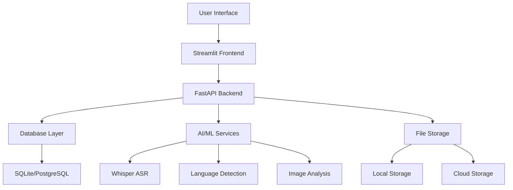

<div align="center">
  
  
  # 🇮🇳 BharatVerse
  
  ### **Capture, Create, Contribute**
  
  <p align="center">
    <strong>Preserving India's Cultural Heritage, One Story at a Time</strong>
  </p>
  
  <p align="center">
    <a href="#-quick-start"></a>
    <a href="#-live-demo"></a>
    <a href="#-contribute"></a>
  </p>
  
  <p align="center">
    
    
    
    
    
  </p>
</div>

---

<div align="center">
  <h3>
    🎯 <a href="#-features">Features</a> •
    🚀 <a href="#-quick-start">Quick Start</a> •
    📖 <a href="#-documentation">Documentation</a> •
    🤝 <a href="#-contributing">Contributing</a> •
    💬 <a href="#-community">Community</a>
  </h3>
</div>

---

## 🌟 Live Demo

<div align="center">
  <a href="https://bharatverse.streamlit.app">
    
  </a>
  <a href="https://bharatverse.streamlit.app">
    
  </a>
</div>

---

## 📺 Demo Video

[](https://www.youtube.com/watch?v=demo_video_id)

*Click to watch the demo video*

---

## 💡 What is BharatVerse?

BharatVerse is an **open-source cultural preservation platform** that empowers Indian communities to:

<table>
<tr>
<td width="50%">

### 🎯 Capture
- **🎙️ Record** folk songs, stories, and oral traditions
- **📝 Document** local customs, recipes, and wisdom
- **📷 Upload** festival photos, traditional art, and cultural symbols

</td>
<td width="50%">

### 🌐 Preserve
- **🤖 AI-powered** transcription and translation
- **🏷️ Smart tagging** for easy discovery
- **📚 Open dataset** for researchers and educators

</td>
</tr>
<tr>
<td width="50%">

### 🤝 Share
- **🌍 Global reach** with multi-language support
- **📱 Mobile-friendly** interface for easy access
- **🔗 Social features** for community engagement

</td>
<td width="50%">

### 🔍 Discover
- **🔎 Advanced search** across all content types
- **📊 Analytics** to track cultural trends
- **🎨 Interactive visualizations** of cultural data

</td>
</tr>
</table>

---

## 🚀 Quick Start

### Option 1: One-Click Deploy

<div align="center">
  <a href="https://app.streamlit.io/deploy?repository=bharatverse/bharatverse">
    
  </a>
</div>

### Option 2: Local Installation

```bash
# Clone the repository
git clone https://github.com/bharatverse/bharatverse.git
cd bharatverse

# Create virtual environment
python -m venv venv
source venv/bin/activate  # On Windows: venv\Scripts\activate

# Install dependencies
pip install -r requirements.txt

# Run the application
streamlit run streamlit_app/app.py
```

🎉 **That's it!** Open http://localhost:8501 in your browser.

---

## ✨ Features

### 🎙️ Audio Capture & Transcription
```python
from bharatverse import AudioProcessor

# Record and transcribe audio
processor = AudioProcessor()
audio_data = processor.record(duration=60)
transcription = processor.transcribe(audio_data, language="hindi")
```

**Capabilities:**
- 🎤 Real-time audio recording
- 🔤 Multi-language transcription (22+ Indian languages)
- 🎵 Music and speech separation
- 📊 Audio quality analysis

### 📝 Story Documentation
```python
from bharatverse import StoryTeller

# Document cultural stories
story = StoryTeller()
story.add_content("Traditional wedding ceremony in Punjab...")
story.set_metadata(language="punjabi", region="punjab", category="wedding")
story.save()
```

**Features:**
- ✍️ Rich text editor with formatting
- 🏷️ Automatic tagging and categorization
- 🌍 Multi-language support
- 📚 Version control for stories

### 📷 Visual Heritage
```python
from bharatverse import ImageProcessor

# Process cultural images
processor = ImageProcessor()
result = processor.analyze_image("festival_photo.jpg")
print(f"Detected: {result.cultural_elements}")
```

**Capabilities:**
- 🖼️ Image upload and processing
- 🤖 AI-powered cultural element detection
- 🏛️ Architecture and art form recognition
- 📍 Geo-tagging and location mapping

---

## 🛠️ Advanced Usage

### Data Export
```bash
bharatverse export --format json --filter "language:hindi"
bharatverse export --format csv --filter "region:rajasthan"
bharatverse export --format parquet --filter "type:folk_song"
```

### API Integration
```python
import requests

# Access BharatVerse API
response = requests.get("https://api.bharatverse.org/stories", 
                       params={"language": "tamil", "limit": 10})
stories = response.json()
```

### Batch Processing
```python
from bharatverse import BatchProcessor

# Process multiple files
processor = BatchProcessor()
results = processor.process_directory("/path/to/cultural/content")
```

---

## 📊 Current Statistics

<div align="center">
  <table>
    <tr>
      <td align="center"><strong>🎵 Audio Files</strong><br>12,456</td>
      <td align="center"><strong>📝 Stories</strong><br>8,923</td>
      <td align="center"><strong>📷 Images</strong><br>15,678</td>
      <td align="center"><strong>🌍 Languages</strong><br>22+</td>
    </tr>
    <tr>
      <td align="center"><strong>👥 Contributors</strong><br>1,234</td>
      <td align="center"><strong>🏛️ Institutions</strong><br>89</td>
      <td align="center"><strong>📍 Regions</strong><br>28 States</td>
      <td align="center"><strong>⭐ GitHub Stars</strong><br>2,456</td>
    </tr>
  </table>
</div>

---

## 🎯 Deployment Options

### Cloud Platforms

<div align="center">
  <a href="https://app.streamlit.io/deploy?repository=bharatverse/bharatverse">
    
  </a>
  <a href="https://colab.research.google.com/github/bharatverse/bharatverse/blob/main/notebooks/quickstart.ipynb">
    
  </a>
</div>

### Self-Hosted
```bash
# Docker deployment
docker-compose up -d

# Kubernetes deployment
kubectl apply -f k8s/
```

---

## 🏗️ Architecture



---

## 🤝 Contributing

We welcome contributions from the community! Here's how you can help:

### 🎯 Ways to Contribute

<table>
<tr>
<td width="50%">

#### 💻 Code Contributions
- 🐛 Bug fixes and improvements
- ✨ New features and enhancements
- 📚 Documentation updates
- 🧪 Tests and quality assurance

</td>
<td width="50%">

#### 🎨 Content Contributions
- 🎵 Audio recordings of folk songs
- 📝 Traditional stories and legends
- 📷 Cultural photographs and art
- 🏷️ Translations and transcriptions

</td>
</tr>
</table>

### 🚀 Getting Started

1. **Fork** the repository
2. **Clone** your fork: `git clone https://github.com/yourusername/bharatverse.git`
3. **Create** a branch: `git checkout -b feature-name`
4. **Make** your changes and test thoroughly
5. **Submit** a pull request with detailed description

### 📋 Development Setup

```bash
# Install development dependencies
pip install -r requirements-dev.txt

# Run tests
pytest tests/

# Format code
black bharatverse/
flake8 bharatverse/

# Run pre-commit hooks
pre-commit run --all-files
```

---

## 📖 Documentation

- 📚 **[User Guide](https://bharatverse.readthedocs.io/user-guide/)** - How to use BharatVerse
- 🔧 **[API Reference](https://bharatverse.readthedocs.io/api/)** - Complete API documentation
- 🏗️ **[Developer Guide](https://bharatverse.readthedocs.io/dev-guide/)** - Contributing and development
- 🎓 **[Tutorials](https://bharatverse.readthedocs.io/tutorials/)** - Step-by-step tutorials
- ❓ **[FAQ](https://bharatverse.readthedocs.io/faq/)** - Frequently asked questions

---

## 💬 Community

<div align="center">
  <a href="https://discord.gg/bharatverse">
    
  </a>
  <a href="https://twitter.com/bharatverse">
    
  </a>
  <a href="https://www.linkedin.com/company/bharatverse">
    
  </a>
</div>

### 🌟 Join Our Community

- 💬 **[Discord Server](https://discord.gg/bharatverse)** - Real-time chat and support
- 🐦 **[Twitter](https://twitter.com/bharatverse)** - Latest updates and news
- 📧 **[Newsletter](https://bharatverse.substack.com)** - Monthly cultural insights
- 📺 **[YouTube](https://youtube.com/bharatverse)** - Tutorials and demos

---

## 🏆 Recognition & Awards

<div align="center">
  
  
  
</div>

---

## 📄 License

<div align="center">
  <table>
    <tr>
      <td><strong>Code</strong></td>
      <td><a href="LICENSE">MIT License</a></td>
      <td>Free for commercial and personal use</td>
    </tr>
    <tr>
      <td><strong>Cultural Content</strong></td>
      <td><a href="LICENSE-CONTENT">CC BY 4.0</a></td>
      <td>Attribution required for cultural data</td>
    </tr>
    <tr>
      <td><strong>Documentation</strong></td>
      <td><a href="LICENSE-DOCS">CC BY-SA 4.0</a></td>
      <td>Share-alike for documentation</td>
    </tr>
  </table>
</div>

---

## 🙏 Acknowledgments

<div align="center">
  <h3>Special Thanks To</h3>
  
  <table>
    <tr>
      <td align="center">
        <strong>🏛️ Cultural Institutions</strong><br>
        Archaeological Survey of India<br>
        Sangeet Natak Akademi<br>
        Sahitya Akademi
      </td>
      <td align="center">
        <strong>🎓 Academic Partners</strong><br>
        IIT Delhi<br>
        IIIT Hyderabad<br>
        JNU New Delhi
      </td>
      <td align="center">
        <strong>💻 Technology Partners</strong><br>
        Streamlit<br>
        Hugging Face<br>
        OpenAI
      </td>
    </tr>
  </table>
</div>

### 👥 Core Contributors

<div align="center">
  <a href="https://github.com/bharatverse/bharatverse/graphs/contributors">
    
  </a>
</div>

---

## 📞 Contact

<div align="center">
  <table>
    <tr>
      <td><strong>📧 Email</strong></td>
      <td><a href="mailto:team@bharatverse.org">team@bharatverse.org</a></td>
    </tr>
    <tr>
      <td><strong>🌐 Website</strong></td>
      <td><a href="https://bharatverse.org">bharatverse.org</a></td>
    </tr>
    <tr>
      <td><strong>📍 Address</strong></td>
      <td>New Delhi, India</td>
    </tr>
  </table>
</div>

---

<div align="center">
  <h2>🇮🇳 Made with ❤️ for India's Cultural Heritage</h2>
  <p><em>"Preserving the past, enriching the future"</em></p>
  
  
</div>